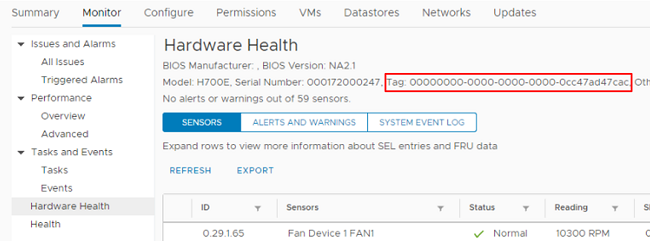

= 如何找出運算節點的硬體標籤
:allow-uri-read: 

[role="lead"]
您需要使用硬體標籤、才能使用REST API UI將運算節點資產新增至管理節點組態。

本節說明如何找出運算節點的硬體標籤。

.步驟
. 在vSphere Web Client瀏覽器中選取主機。
. 選擇*顯示器*標籤、然後選取*硬體健全狀況*。
. 視您執行的vSphere版本而定、您可以在「*硬體健全狀況*」畫面上、找到下列其中一個位置的硬體標籤。
+
** 檢查標籤是否列有BIOS製造商和型號。
+

** 選擇* Configure（配置）*選項卡。從側邊列選取*硬體*和*總覽*。檢查硬體標籤是否列在「系統」表格中。
+
image:../media/hw_tag_70.PNG["硬體健全狀況"]

. 複製並儲存「標記」的值。
. 若要將運算節點資產新增至管理節點、請前往 xref:task_mnode_add_assets.adoc[將運算和控制器資產新增至管理節點]。

